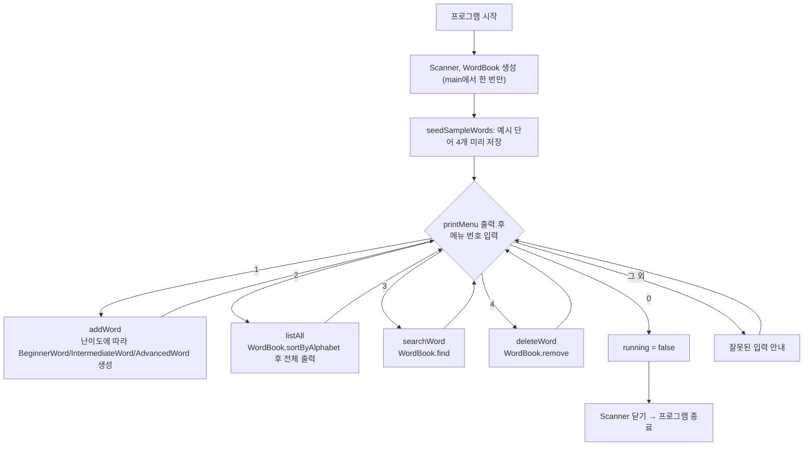
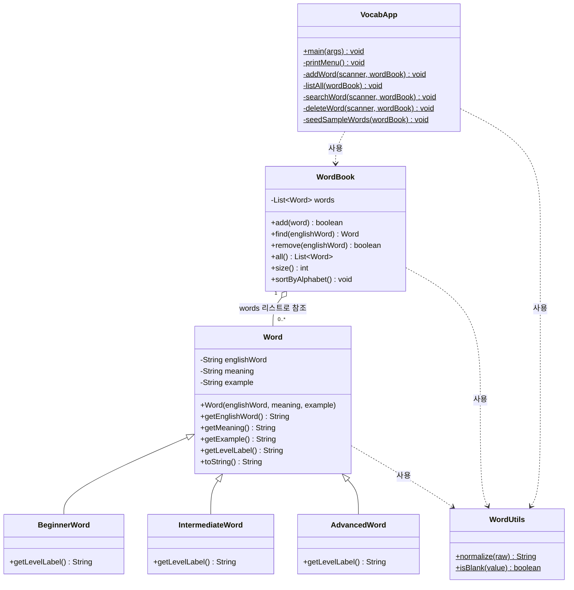
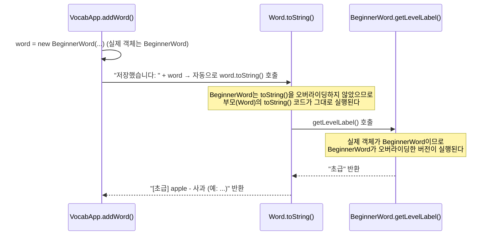

# 단어장 v2 — 구조 해설 & 코드 입력 자료

이 자료는 **강의 6~9주차**(5장 상속·다형성·인터페이스 / 6장 모듈과 패키지 /
7장 제네릭·컬렉션)에 맞춘 콘솔 단어장 v2의 구조를 먼저 설명하고, 뒤에 전체
코드를 실어 학생이 직접 타이핑하며 연습할 수 있도록 만들었습니다.

v1과 달리 **이번에는 코드를 전부 입력하지 않습니다.** 이번 단원에서 새로
배우는 개념(상속·오버라이딩, 컬렉션, 패키지)이 드러나는 부분만 직접 입력하고,
나머지(이미 v1에서 써본 로직)는 미리 채워진 스켈레톤을 그대로 씁니다. 어디를
입력해야 하는지는 7번 섹션에서 `+` 표시(초록색)로 안내합니다.

---

## 1. 무엇을 만드는가

v1과 **기능은 동일**합니다. 메뉴 번호를 입력하면 단어를 **추가·조회·검색·삭제**할
수 있고, 등록한 단어는 프로그램을 종료하면 사라집니다.

```
1. 단어 추가       2. 전체 목록 (알파벳순)
3. 단어 검색       4. 단어 삭제
0. 종료
```

## 2. 코드 구조 — 왜 파일이 7개로 늘었나

v1은 파일 2개(`Word.java`, `VocabAppV1.java`)였지만, v2는 상속·컬렉션·패키지를
배우면서 역할별로 파일과 패키지를 나눕니다.

```
com.example.vocabv2
├─ model/
│  ├─ Word.java              단어의 공통 필드 + "표시 이름"을 재정의 가능한 메서드로 뺀 부모 클래스
│  ├─ BeginnerWord.java      초급 단어 (Word를 상속)
│  ├─ IntermediateWord.java  중급 단어 (Word를 상속)
│  └─ AdvancedWord.java      고급 단어 (Word를 상속)
├─ util/
│  └─ WordUtils.java         문자열 정리(normalize/isBlank) static 메서드 모음
├─ store/
│  └─ WordBook.java          List<Word>로 단어를 저장·검색·삭제·정렬하는 컬렉션 클래스
└─ app/
   └─ VocabApp.java          main(), 메뉴 루프 — v1의 VocabAppV1 역할
```

| 패키지 | 역할 |
|---|---|
| `model` | 단어를 표현하는 **데이터** — 상속으로 난이도별 표시 이름을 다르게 함 |
| `util` | 여러 클래스가 공통으로 쓰는 문자열 처리 |
| `store` | 단어 여러 개를 **컬렉션**(`List`)으로 관리 |
| `app` | `main()`과 메뉴 **동작(로직)** |

v1의 "설계 규칙"(모든 메서드가 `Scanner`/`words`/`count`를 매개변수로 주고받는
것)은 그대로입니다. 다만 `words`와 `count`가 이제 `WordBook` 객체 하나로
합쳐졌습니다 — 배열과 개수를 따로 들고 다니지 않아도 됩니다.

## 3. 프로그램 흐름도



v1과 흐름 자체는 같습니다. 달라진 것은 `addWord`가 난이도에 따라 **서로 다른
클래스의 객체**를 만든다는 점, 그리고 `words`/`count`를 직접 주고받는 대신
`WordBook` 하나를 주고받는다는 점입니다.

## 4. 클래스 구조



`$` 표시는 `static` 메서드라는 뜻입니다. v1의 `Word[] words` 배열 참조가
`WordBook`의 `List<Word>` 참조로 바뀐 것, 그리고 `Word` 아래로 세 자식
클래스가 화살표(상속)로 붙은 것이 v1 클래스 구조와의 핵심 차이입니다.

## 5. v1과 다른 점 비교

| v1의 방식 | 한계 | v2에서 어떻게 바뀌는가 |
|---|---|---|
| 난이도는 `Word`의 `int level` 필드 하나뿐, `toString()`에서 `if/else`로 표시 이름 결정 | 난이도가 늘어날 때마다 `if/else`를 계속 고쳐야 함 | `BeginnerWord`/`IntermediateWord`/`AdvancedWord`가 `getLevelLabel()`을 오버라이딩 → if/else가 다형성으로 대체됨 |
| `Word[] words = new Word[20]` 고정 배열 | 21번째 단어부터 저장 불가 | `List<Word> words = new ArrayList<>()` → 크기 제한 사라짐 |
| 삭제 시 뒤 원소를 한 칸씩 손으로 당기는 `for` 루프 | 의도가 코드에 가려짐 | `words.remove(target)` 한 줄로 대체 |
| `count`를 모든 메서드가 매개변수/반환값으로 주고받음 | 호출하는 쪽이 개수를 계속 챙겨야 함 | `WordBook`이 캡슐화 → 바깥에서 단어 개수(`count`)를 직접 들고 다닐 필요 없음 |
| 문자열 검사가 `VocabAppV1` 안 private 메서드 | 재사용 어려움 | `WordUtils`로 분리 + `model`/`util`/`store`/`app` 패키지 분리 |
| 파일 2개, 패키지 없음 | 클래스가 늘어나면 한눈에 안 들어옴 | `model`/`util`/`store`/`app` 4개 패키지로 역할 분리 |

### `toString()`이 실제로 동작하는 순서 (트레이싱 예시)

`Word`에는 `getLevelLabel()`이 `"일반"`을 반환하도록 적혀 있는데, 왜 화면에는
`"초급"`/`"중급"`/`"고급"`이 나올까요? 위 표의 1번째 줄(`getLevelLabel()` 오버라이딩)이
실제로 호출될 때 무슨 일이 일어나는지, 초급 단어 하나를 추가하는 순간을 따라가
보겠습니다.



1. `addWord()`에서 난이도가 1이면 `word = new BeginnerWord(...)`로 **실제 객체는
   `BeginnerWord`**를 만듭니다. 변수의 선언 타입은 `Word word`지만, 객체 자체는
   `BeginnerWord`입니다.
2. `System.out.println("저장했습니다: " + word)`에서 `word`가 문자열과 `+`로
   합쳐지므로 자바가 자동으로 `word.toString()`을 호출합니다.
3. `BeginnerWord`는 `toString()`을 오버라이딩하지 않았으므로, 부모인
   `Word.toString()` 코드가 실행됩니다.
4. `Word.toString()` 안에서 `getLevelLabel()`을 호출하는 순간, 자바는 **선언
   타입(`Word`)이 아니라 실제 객체(`BeginnerWord`)를 기준으로** 메서드를 찾습니다.
   `BeginnerWord`가 `getLevelLabel()`을 오버라이딩했으므로 그 버전이 실행되어
   `"초급"`을 반환합니다.
5. `Word.toString()`은 이 값을 받아 `"[초급] apple - 사과 (예: ...)"`를 완성해
   돌려줍니다.

**핵심**: `Word.toString()` 코드는 하나뿐이지만, 그 안에서 `getLevelLabel()`을
호출하는 순간 "실제 객체가 무엇이냐"에 따라 다른 메서드가 실행됩니다(3~4번
단계). 이게 오버라이딩과 다형성이 실제로 동작하는 방식입니다. `word`가
`IntermediateWord`/`AdvancedWord` 객체였다면 4번 단계에서 각각 그 클래스의
`getLevelLabel()`이 대신 실행됩니다.

**예외처리는 v1에서 이미 배웠으므로 그대로 씁니다.** 난이도 입력을
`Integer.parseInt` + `try-catch(NumberFormatException)`로 처리하는 방식은
v1과 동일합니다 — 그래서 이 부분은 이번에 새로 입력할 대상이 아닙니다 (6번 참고).

## 6. 주요 멤버 설명

### `model.Word` — 공통 필드 + 오버라이딩 가능한 표시 이름

| 멤버 | 설명 |
|---|---|
| `englishWord`, `meaning`, `example` | v1과 동일하게 생성자에서 한 번 정해지는(`final`) 필드. `level` 필드는 없어짐 |
| `Word(...)` 생성자 | 문자열 정리는 이제 `WordUtils.normalize()`에 위임 |
| `getLevelLabel()` | 기본값 `"일반"`을 반환하는 **오버라이딩 대상 메서드**. 자식 클래스가 각자 다시 정의한다 |
| `toString()` | `getLevelLabel()`을 호출 — 실제 호출되는 것은 **런타임에 결정되는 자식 클래스의 버전**(다형성) |

### `model.BeginnerWord` / `IntermediateWord` / `AdvancedWord`

| 멤버 | 설명 |
|---|---|
| `extends Word` | `Word`의 필드·메서드를 그대로 물려받음 |
| 생성자 | 본인이 할 일은 없고 `super(...)`로 부모 생성자에 위임 |
| `getLevelLabel()` 오버라이딩 | 각각 `"초급"`/`"중급"`/`"고급"` 반환 |

### `util.WordUtils` — 공통 문자열 처리

| 멤버 | 설명 |
|---|---|
| `normalize(raw)` | 공백 제거 + 소문자 통일. `null`은 빈 문자열로 취급 |
| `isBlank(value)` | `null`이거나 공백뿐인지 확인 |

### `store.WordBook` — 컬렉션으로 단어 관리

| 멤버 | 설명 |
|---|---|
| `words` (`List<Word>`) | v1의 `Word[] words` + `int count`를 대신하는 컬렉션 필드 |
| `add(word)` | 중복이면 `false`, 아니면 `words.add(word)` 후 `true` |
| `find(englishWord)` | 리스트를 순회하며 일치하는 `Word`를 찾아 반환 (없으면 `null`) |
| `remove(englishWord)` | `find`로 찾은 뒤 `words.remove(target)` |
| `all()` / `size()` | 전체 리스트 / 저장된 개수 반환 |
| `sortByAlphabet()` | v1과 동일한 선택 정렬 알고리즘, 배열 인덱스 대신 `words.get/set` 사용 |

### `app.VocabApp` — 실행과 메뉴 로직

| 메서드 | 설명 |
|---|---|
| `main` | Scanner·`WordBook` 생성, 예시 단어 등록, 메뉴 반복(`while`) 실행 |
| `printMenu` | 메뉴 화면 출력 |
| `addWord` | 입력 검사는 v1과 동일 + **난이도에 따라 다른 자식 클래스 생성** (다형성의 시작점) |
| `listAll` | `wordBook.sortByAlphabet()` 후 `wordBook.all()`을 순서대로 출력 |
| `searchWord` / `deleteWord` | `wordBook.find()` / `wordBook.remove()` 호출 |
| `seedSampleWords` | 시작할 때 예시 단어 4개를 `wordBook`에 채움 |

---

## 7. 코드 입력 안내

선생님이 나눠준 스켈레톤 프로젝트에는 **색 표시가 없는 줄이 이미 채워져
있습니다.** 아래 코드에서 **초록색(`+`) 줄만 직접 입력**하세요. 표시가 없는
줄은 이미 있는 코드를 눈으로 확인만 하면 됩니다.

```diff
  이 줄처럼 앞에 아무 표시가 없으면 → 이미 채워져 있는 코드 (읽기만 하세요)
+ 이 줄처럼 앞에 + 표시(초록색)가 있으면 → 직접 입력하세요
```

직접 입력하는 부분은 아래 네 가지로 요약됩니다.

1. **모든 파일의 `package`/`import` 선언** — 이번에 처음 배우는 패키지 개념
2. **`BeginnerWord`/`IntermediateWord`/`AdvancedWord` 파일 전체** — 상속 + 오버라이딩
3. **`WordBook`의 필드 선언과 `add`/`find`/`remove`/`all`/`size`** — 컬렉션(`List`) 사용
4. **`VocabApp.addWord()`의 난이도별 객체 생성 분기** — 다형성을 실제로 "쓰는" 지점

<div style="page-break-after: always;"></div>

## model/Word.java

```diff
+package com.example.vocabv2.model;

+import com.example.vocabv2.util.WordUtils;

/**
 * 단어 하나(영단어 + 뜻 + 예문)를 나타내는 기본 클래스.
 *
 * 이 클래스 자체로도 쓸 수 있지만, 실제로 프로그램에서 만드는 단어는 항상
 * BeginnerWord / IntermediateWord / AdvancedWord 중 하나다. 난이도별로
 * "표시 이름"이 달라지는데, 그 다른 동작을 자식 클래스가 메서드 오버라이딩으로
 * 결정하게 만든 것이 이 예제의 핵심이다 (상속 + 다형성).
 */
public class Word {

    // private로 막아서 자식 클래스도 직접 건드리지 못하게 하고, getter로만 접근하게 한다.
    private final String englishWord;
    private final String meaning;
    private final String example;

    public Word(String englishWord, String meaning, String example) {
        // 저장 시점에 미리 정리해두면, 검색할 때마다 매번 trim/소문자 변환을 할 필요가 없다.
        this.englishWord = WordUtils.normalize(englishWord);
        this.meaning = meaning == null ? "" : meaning.trim();
        this.example = example == null ? "" : example.trim();
    }

    public String getEnglishWord() {
        return englishWord;
    }

    public String getMeaning() {
        return meaning;
    }

    public String getExample() {
        return example;
    }

    /** 화면에 보여줄 난이도 이름. 기본값은 "일반" (자식 클래스가 각자 재정의) */
    public String getLevelLabel() {
        return "일반";
    }

    @Override
    public String toString() {
        String base = "[" + getLevelLabel() + "] " + englishWord + " - " + meaning;
        if (!example.isEmpty()) {
            return base + " (예: " + example + ")";
        }
        return base;
    }
}
```

<div style="page-break-after: always;"></div>

## model/BeginnerWord.java

```diff
+package com.example.vocabv2.model;

+/** 초급 단어. */
+public class BeginnerWord extends Word {
+
+    public BeginnerWord(String englishWord, String meaning, String example) {
+        super(englishWord, meaning, example); // 공통 필드 저장은 부모 생성자에게 맡긴다
+    }
+
+    @Override
+    public String getLevelLabel() {
+        return "초급";
+    }
+}
```

## model/IntermediateWord.java

```diff
+package com.example.vocabv2.model;

+/** 중급 단어. */
+public class IntermediateWord extends Word {
+
+    public IntermediateWord(String englishWord, String meaning, String example) {
+        super(englishWord, meaning, example);
+    }
+
+    @Override
+    public String getLevelLabel() {
+        return "중급";
+    }
+}
```

## model/AdvancedWord.java

```diff
+package com.example.vocabv2.model;

+/** 고급 단어. */
+public class AdvancedWord extends Word {
+
+    public AdvancedWord(String englishWord, String meaning, String example) {
+        super(englishWord, meaning, example);
+    }
+
+    @Override
+    public String getLevelLabel() {
+        return "고급";
+    }
+}
```

<div style="page-break-after: always;"></div>

## util/WordUtils.java

```diff
+package com.example.vocabv2.util;

/**
 * 여러 클래스(Word, WordBook, VocabApp)에서 공통으로 쓰는
 * 문자열 처리 static 메서드 모음.
 *
 * 인스턴스를 만들 필요가 없는 클래스이므로 생성자를 private으로 막는다
 * (new WordUtils() 를 못 하게 하는, static 유틸리티 클래스의 전형적인 형태).
 */
public final class WordUtils {

    private WordUtils() {
    }

    /** 앞뒤 공백 제거 + 소문자 통일. null이면 빈 문자열로 취급한다. */
    public static String normalize(String raw) {
        if (raw == null) {
            return "";
        }
        return raw.trim().toLowerCase();
    }

    /** 값이 null이거나, 공백만 있는 문자열인지 확인한다. */
    public static boolean isBlank(String value) {
        return value == null || value.trim().isEmpty();
    }
}
```

<div style="page-break-after: always;"></div>

## store/WordBook.java

```diff
+package com.example.vocabv2.store;

+import com.example.vocabv2.model.Word;
+import com.example.vocabv2.util.WordUtils;

+import java.util.ArrayList;
+import java.util.List;

/**
 * 단어들을 메모리에 저장하고 관리하는 클래스.
 *
 * DB를 쓰지 않으므로 프로그램을 끄면 데이터는 사라진다 — 이 한계는 나중에
 * (학기말 과제에서) JDBC로 SQLite에 저장하는 방식으로 해결하게 된다.
 * 지금은 "여러 개의 객체를 어떻게 컬렉션으로 관리하는가"에 집중한다.
 */
public class WordBook {

    // 배열(Word[])로 만들면 처음에 크기를 정해야 하고, 단어가 늘어나면 새 배열로 복사해야 한다.
    // ArrayList<Word>는 그 작업을 알아서 해주므로, 실무에서는 대부분 배열 대신 이렇게 컬렉션을 쓴다.
+    private final List<Word> words = new ArrayList<>();

+    /** 이미 같은 단어(영단어 기준)가 있으면 추가하지 않고 false를 돌려준다. */
+    public boolean add(Word word) {
+        if (find(word.getEnglishWord()) != null) {
+            return false;
+        }
+        words.add(word);
+        return true;
+    }

+    public Word find(String englishWord) {
+        String key = WordUtils.normalize(englishWord);
+        for (Word w : words) {
+            if (w.getEnglishWord().equals(key)) {
+                return w;
+            }
+        }
+        return null;
+    }

+    public boolean remove(String englishWord) {
+        Word target = find(englishWord);
+        if (target == null) {
+            return false;
+        }
+        return words.remove(target);
+    }

+    public List<Word> all() {
+        return words;
+    }

+    public int size() {
+        return words.size();
+    }

    /**
     * 영단어 알파벳순으로 정렬한다.
     * Comparator/람다 없이, 배열/리스트를 직접 훑는 선택 정렬(selection sort)로 구현했다.
     * String끼리 순서를 비교할 때는 JDK가 제공하는 String.compareTo()를 사용한다
     * (음수면 앞쪽 문자열이 사전순으로 더 앞, 0이면 같음, 양수면 더 뒤).
     */
    public void sortByAlphabet() {
        for (int i = 0; i < words.size() - 1; i++) {
            int minIndex = i;
            for (int j = i + 1; j < words.size(); j++) {
                if (words.get(j).getEnglishWord().compareTo(words.get(minIndex).getEnglishWord()) < 0) {
                    minIndex = j;
                }
            }
            if (minIndex != i) {
                Word temp = words.get(i);
                words.set(i, words.get(minIndex));
                words.set(minIndex, temp);
            }
        }
    }
}
```

<div style="page-break-after: always;"></div>

## app/VocabApp.java

```diff
+package com.example.vocabv2.app;

+import com.example.vocabv2.model.AdvancedWord;
+import com.example.vocabv2.model.BeginnerWord;
+import com.example.vocabv2.model.IntermediateWord;
+import com.example.vocabv2.model.Word;
+import com.example.vocabv2.store.WordBook;
+import com.example.vocabv2.util.WordUtils;

+import java.util.List;
+import java.util.Scanner;

/**
 * 콘솔 기반 미니 단어장. DB/GUI/네트워크 없이, 프로그램이 켜져 있는 동안만
 * 메모리(WordBook 안의 List) 위에서 단어를 관리한다.
 *
 * 이 프로그램에서 연습하는 것:
 *  - 클래스/객체, 접근지정자(private 필드 + public 메서드)
 *  - 상속과 메서드 오버라이딩 (Word -> BeginnerWord/IntermediateWord/AdvancedWord)
 *  - 컬렉션과 제네릭 (List<Word>, ArrayList<Word>)
 *  - 조건문/반복문, JDK 제공 클래스 (Scanner, String, Character)
 *  - 패키지 (model / util / store / app 로 역할을 나눠 놓음)
 */
public class VocabApp {

    public static void main(String[] args) {
        Scanner scanner = new Scanner(System.in);
        WordBook wordBook = new WordBook();
        seedSampleWords(wordBook); // 빈 화면으로 시작하지 않도록 예시 단어를 미리 넣어둔다

        boolean running = true;
        while (running) {
            printMenu();
            System.out.print("선택: ");
            String choice = scanner.nextLine();

            switch (choice) {
                case "1":
                    addWord(scanner, wordBook);
                    break;
                case "2":
                    listAll(wordBook);
                    break;
                case "3":
                    searchWord(scanner, wordBook);
                    break;
                case "4":
                    deleteWord(scanner, wordBook);
                    break;
                case "0":
                    running = false;
                    break;
                default:
                    System.out.println("잘못된 입력입니다. 메뉴 번호를 다시 선택하세요.");
            }
        }

        System.out.println("프로그램을 종료합니다. (등록된 단어 " + wordBook.size() + "개는 저장되지 않습니다)");
        scanner.close();
    }

    private static void printMenu() {
        System.out.println();
        System.out.println("===== 미니 단어장 (v2) =====");
        System.out.println("1. 단어 추가");
        System.out.println("2. 전체 목록 (알파벳순)");
        System.out.println("3. 단어 검색");
        System.out.println("4. 단어 삭제");
        System.out.println("0. 종료");
    }

    private static void addWord(Scanner scanner, WordBook wordBook) {
        System.out.print("영어 단어: ");
        String englishWord = scanner.nextLine();
        if (WordUtils.isBlank(englishWord)) {
            System.out.println("단어를 입력하지 않아 취소합니다.");
            return;
        }
        System.out.print("뜻: ");
        String meaning = scanner.nextLine();
        System.out.print("예문 (없으면 그냥 엔터): ");
        String example = scanner.nextLine();

        System.out.println("난이도를 선택하세요. 1) 초급  2) 중급  3) 고급");
        System.out.print("선택: ");
        String levelChoice = scanner.nextLine();

        // v1(3주차)에서 배운 try-catch를 여기서도 그대로 쓴다 — 숫자가 아닌 입력이 오면
        // NumberFormatException을 잡아서 기본값(초급)으로 처리한다.
        int level;
        try {
            level = Integer.parseInt(levelChoice);
        } catch (NumberFormatException e) {
            level = 1;
        }

+        // 선택한 난이도에 따라 서로 다른 자식 클래스의 객체를 만든다 (다형성의 시작점).
+        Word word;
+        if (level == 2) {
+            word = new IntermediateWord(englishWord, meaning, example);
+        } else if (level == 3) {
+            word = new AdvancedWord(englishWord, meaning, example);
+        } else {
+            word = new BeginnerWord(englishWord, meaning, example);
+        }

        boolean added = wordBook.add(word);
        System.out.println(added ? "저장했습니다: " + word : "이미 등록된 단어입니다.");
    }

    private static void listAll(WordBook wordBook) {
        if (wordBook.size() == 0) {
            System.out.println("등록된 단어가 없습니다.");
            return;
        }
        wordBook.sortByAlphabet();
        List<Word> all = wordBook.all();
        for (int i = 0; i < all.size(); i++) {
            System.out.println((i + 1) + ". " + all.get(i));
        }
    }

    private static void searchWord(Scanner scanner, WordBook wordBook) {
        System.out.print("검색할 단어: ");
        String key = scanner.nextLine();
        Word found = wordBook.find(key);
        System.out.println(found != null ? found.toString() : "등록되지 않은 단어입니다.");
    }

    private static void deleteWord(Scanner scanner, WordBook wordBook) {
        System.out.print("삭제할 단어: ");
        String key = scanner.nextLine();
        boolean removed = wordBook.remove(key);
        System.out.println(removed ? "삭제했습니다." : "등록되지 않은 단어입니다.");
    }

    private static void seedSampleWords(WordBook wordBook) {
        wordBook.add(new BeginnerWord("apple", "사과", "I eat an apple every day."));
        wordBook.add(new BeginnerWord("book", "책", "This book is interesting."));
        wordBook.add(new IntermediateWord("achieve", "성취하다", "She achieved her goal."));
        wordBook.add(new AdvancedWord("ambiguous", "애매한", "The instructions were ambiguous."));
    }
}
```

<div style="page-break-after: always;"></div>

## 부록 — 전체 코드 (참고용)

앞에서 색으로 나눈 코드와 기능은 완전히 같고, 표시 없이 파일 전체를 이어붙인
버전입니다. 스켈레톤에 입력하다가 막히면 참고하세요. (주석은 위 코드에 이미
포함된 것과 동일하며 줄마다 추가 설명을 달지 않았습니다 — 각 멤버의 의미는
6번 "주요 멤버 설명"을 참고하세요.)

### model/Word.java

```java
package com.example.vocabv2.model;

import com.example.vocabv2.util.WordUtils;

public class Word {

    private final String englishWord;
    private final String meaning;
    private final String example;

    public Word(String englishWord, String meaning, String example) {
        this.englishWord = WordUtils.normalize(englishWord);
        this.meaning = meaning == null ? "" : meaning.trim();
        this.example = example == null ? "" : example.trim();
    }

    public String getEnglishWord() {
        return englishWord;
    }

    public String getMeaning() {
        return meaning;
    }

    public String getExample() {
        return example;
    }

    public String getLevelLabel() {
        return "일반";
    }

    @Override
    public String toString() {
        String base = "[" + getLevelLabel() + "] " + englishWord + " - " + meaning;
        if (!example.isEmpty()) {
            return base + " (예: " + example + ")";
        }
        return base;
    }
}
```

### model/BeginnerWord.java / IntermediateWord.java / AdvancedWord.java

```java
package com.example.vocabv2.model;

public class BeginnerWord extends Word {

    public BeginnerWord(String englishWord, String meaning, String example) {
        super(englishWord, meaning, example);
    }

    @Override
    public String getLevelLabel() {
        return "초급";
    }
}
```

```java
package com.example.vocabv2.model;

public class IntermediateWord extends Word {

    public IntermediateWord(String englishWord, String meaning, String example) {
        super(englishWord, meaning, example);
    }

    @Override
    public String getLevelLabel() {
        return "중급";
    }
}
```

```java
package com.example.vocabv2.model;

public class AdvancedWord extends Word {

    public AdvancedWord(String englishWord, String meaning, String example) {
        super(englishWord, meaning, example);
    }

    @Override
    public String getLevelLabel() {
        return "고급";
    }
}
```

### util/WordUtils.java

```java
package com.example.vocabv2.util;

public final class WordUtils {

    private WordUtils() {
    }

    public static String normalize(String raw) {
        if (raw == null) {
            return "";
        }
        return raw.trim().toLowerCase();
    }

    public static boolean isBlank(String value) {
        return value == null || value.trim().isEmpty();
    }
}
```

### store/WordBook.java

```java
package com.example.vocabv2.store;

import com.example.vocabv2.model.Word;
import com.example.vocabv2.util.WordUtils;

import java.util.ArrayList;
import java.util.List;

public class WordBook {

    private final List<Word> words = new ArrayList<>();

    public boolean add(Word word) {
        if (find(word.getEnglishWord()) != null) {
            return false;
        }
        words.add(word);
        return true;
    }

    public Word find(String englishWord) {
        String key = WordUtils.normalize(englishWord);
        for (Word w : words) {
            if (w.getEnglishWord().equals(key)) {
                return w;
            }
        }
        return null;
    }

    public boolean remove(String englishWord) {
        Word target = find(englishWord);
        if (target == null) {
            return false;
        }
        return words.remove(target);
    }

    public List<Word> all() {
        return words;
    }

    public int size() {
        return words.size();
    }

    public void sortByAlphabet() {
        for (int i = 0; i < words.size() - 1; i++) {
            int minIndex = i;
            for (int j = i + 1; j < words.size(); j++) {
                if (words.get(j).getEnglishWord().compareTo(words.get(minIndex).getEnglishWord()) < 0) {
                    minIndex = j;
                }
            }
            if (minIndex != i) {
                Word temp = words.get(i);
                words.set(i, words.get(minIndex));
                words.set(minIndex, temp);
            }
        }
    }
}
```

### app/VocabApp.java

```java
package com.example.vocabv2.app;

import com.example.vocabv2.model.AdvancedWord;
import com.example.vocabv2.model.BeginnerWord;
import com.example.vocabv2.model.IntermediateWord;
import com.example.vocabv2.model.Word;
import com.example.vocabv2.store.WordBook;
import com.example.vocabv2.util.WordUtils;

import java.util.List;
import java.util.Scanner;

public class VocabApp {

    public static void main(String[] args) {
        Scanner scanner = new Scanner(System.in);
        WordBook wordBook = new WordBook();
        seedSampleWords(wordBook);

        boolean running = true;
        while (running) {
            printMenu();
            System.out.print("선택: ");
            String choice = scanner.nextLine();

            switch (choice) {
                case "1":
                    addWord(scanner, wordBook);
                    break;
                case "2":
                    listAll(wordBook);
                    break;
                case "3":
                    searchWord(scanner, wordBook);
                    break;
                case "4":
                    deleteWord(scanner, wordBook);
                    break;
                case "0":
                    running = false;
                    break;
                default:
                    System.out.println("잘못된 입력입니다. 메뉴 번호를 다시 선택하세요.");
            }
        }

        System.out.println("프로그램을 종료합니다. (등록된 단어 " + wordBook.size() + "개는 저장되지 않습니다)");
        scanner.close();
    }

    private static void printMenu() {
        System.out.println();
        System.out.println("===== 미니 단어장 (v2) =====");
        System.out.println("1. 단어 추가");
        System.out.println("2. 전체 목록 (알파벳순)");
        System.out.println("3. 단어 검색");
        System.out.println("4. 단어 삭제");
        System.out.println("0. 종료");
    }

    private static void addWord(Scanner scanner, WordBook wordBook) {
        System.out.print("영어 단어: ");
        String englishWord = scanner.nextLine();
        if (WordUtils.isBlank(englishWord)) {
            System.out.println("단어를 입력하지 않아 취소합니다.");
            return;
        }
        System.out.print("뜻: ");
        String meaning = scanner.nextLine();
        System.out.print("예문 (없으면 그냥 엔터): ");
        String example = scanner.nextLine();

        System.out.println("난이도를 선택하세요. 1) 초급  2) 중급  3) 고급");
        System.out.print("선택: ");
        String levelChoice = scanner.nextLine();

        int level;
        try {
            level = Integer.parseInt(levelChoice);
        } catch (NumberFormatException e) {
            level = 1;
        }

        Word word;
        if (level == 2) {
            word = new IntermediateWord(englishWord, meaning, example);
        } else if (level == 3) {
            word = new AdvancedWord(englishWord, meaning, example);
        } else {
            word = new BeginnerWord(englishWord, meaning, example);
        }

        boolean added = wordBook.add(word);
        System.out.println(added ? "저장했습니다: " + word : "이미 등록된 단어입니다.");
    }

    private static void listAll(WordBook wordBook) {
        if (wordBook.size() == 0) {
            System.out.println("등록된 단어가 없습니다.");
            return;
        }
        wordBook.sortByAlphabet();
        List<Word> all = wordBook.all();
        for (int i = 0; i < all.size(); i++) {
            System.out.println((i + 1) + ". " + all.get(i));
        }
    }

    private static void searchWord(Scanner scanner, WordBook wordBook) {
        System.out.print("검색할 단어: ");
        String key = scanner.nextLine();
        Word found = wordBook.find(key);
        System.out.println(found != null ? found.toString() : "등록되지 않은 단어입니다.");
    }

    private static void deleteWord(Scanner scanner, WordBook wordBook) {
        System.out.print("삭제할 단어: ");
        String key = scanner.nextLine();
        boolean removed = wordBook.remove(key);
        System.out.println(removed ? "삭제했습니다." : "등록되지 않은 단어입니다.");
    }

    private static void seedSampleWords(WordBook wordBook) {
        wordBook.add(new BeginnerWord("apple", "사과", "I eat an apple every day."));
        wordBook.add(new BeginnerWord("book", "책", "This book is interesting."));
        wordBook.add(new IntermediateWord("achieve", "성취하다", "She achieved her goal."));
        wordBook.add(new AdvancedWord("ambiguous", "애매한", "The instructions were ambiguous."));
    }
}
```

<div style="page-break-after: always;"></div>

## 부록 — 주석 포함 버전 (참고용)

앞의 두 부록(색 표시 버전, 전체 코드 버전)과 기능은 완전히 같고, 각 줄 오른쪽에
동작을 설명하는 주석만 추가된 버전입니다. 입력하다가 막히면 참고하세요.

### model/Word.java (주석 포함)

```java
package com.example.vocabv2.model; // model 패키지에 속한다고 선언한다.

import com.example.vocabv2.util.WordUtils; // util 패키지의 WordUtils를 가져와 쓴다.

public class Word { // 단어 하나를 표현하는 부모 클래스를 선언한다.

    private final String englishWord; // 생성 후 바뀌지 않는 영어 단어를 저장한다.
    private final String meaning; // 생성 후 바뀌지 않는 뜻을 저장한다.
    private final String example; // 생성 후 바뀌지 않는 예문을 저장한다.

    public Word(String englishWord, String meaning, String example) { // 세 가지 정보로 Word 객체를 만든다.
        this.englishWord = WordUtils.normalize(englishWord); // 공백 제거 + 소문자 변환은 WordUtils에 맡긴다.
        this.meaning = meaning == null ? "" : meaning.trim(); // null은 빈 문자열로, 나머지는 공백만 제거해 저장한다.
        this.example = example == null ? "" : example.trim(); // null은 빈 문자열로, 나머지는 공백만 제거해 저장한다.
    }

    public String getEnglishWord() { // 저장된 영어 단어를 반환한다.
        return englishWord; // englishWord 필드 값을 호출한 곳에 돌려준다.
    }

    public String getMeaning() { // 저장된 뜻을 반환한다.
        return meaning; // meaning 필드 값을 호출한 곳에 돌려준다.
    }

    public String getExample() { // 저장된 예문을 반환한다.
        return example; // example 필드 값을 호출한 곳에 돌려준다.
    }

    public String getLevelLabel() { // 화면에 보여줄 난이도 이름을 반환한다 — 자식 클래스가 오버라이딩할 대상이다.
        return "일반"; // 자식 클래스가 따로 정의하지 않았을 때의 기본값이다.
    }

    @Override // Object의 toString()을 재정의한다는 표시다.
    public String toString() { // Word 객체를 문자열로 표시할 형식을 만든다.
        String base = "[" + getLevelLabel() + "] " + englishWord + " - " + meaning; // getLevelLabel()은 실제 객체(자식 클래스)의 버전이 호출된다 — 다형성.
        if (!example.isEmpty()) { // 예문이 있는지 확인한다.
            return base + " (예: " + example + ")"; // 기본 문자열 뒤에 예문을 붙여 반환한다.
        }
        return base; // 예문이 없으면 기본 문자열만 반환한다.
    }
}
```

<div style="page-break-after: always;"></div>

### model/BeginnerWord.java / IntermediateWord.java / AdvancedWord.java (주석 포함)

```java
package com.example.vocabv2.model; // model 패키지에 속한다고 선언한다.

public class BeginnerWord extends Word { // Word를 상속받아 초급 단어를 표현한다.

    public BeginnerWord(String englishWord, String meaning, String example) { // 세 가지 정보를 받아 객체를 만든다.
        super(englishWord, meaning, example); // 공통 필드 저장은 부모(Word) 생성자에게 맡긴다.
    }

    @Override // 부모의 getLevelLabel()을 다시 정의한다는 표시다.
    public String getLevelLabel() { // 이 클래스만의 표시 이름을 정한다.
        return "초급"; // 초급 단어의 표시 이름을 반환한다.
    }
}
```

```java
package com.example.vocabv2.model; // model 패키지에 속한다고 선언한다.

public class IntermediateWord extends Word { // Word를 상속받아 중급 단어를 표현한다.

    public IntermediateWord(String englishWord, String meaning, String example) { // 세 가지 정보를 받아 객체를 만든다.
        super(englishWord, meaning, example); // 공통 필드 저장은 부모(Word) 생성자에게 맡긴다.
    }

    @Override // 부모의 getLevelLabel()을 다시 정의한다는 표시다.
    public String getLevelLabel() { // 이 클래스만의 표시 이름을 정한다.
        return "중급"; // 중급 단어의 표시 이름을 반환한다.
    }
}
```

```java
package com.example.vocabv2.model; // model 패키지에 속한다고 선언한다.

public class AdvancedWord extends Word { // Word를 상속받아 고급 단어를 표현한다.

    public AdvancedWord(String englishWord, String meaning, String example) { // 세 가지 정보를 받아 객체를 만든다.
        super(englishWord, meaning, example); // 공통 필드 저장은 부모(Word) 생성자에게 맡긴다.
    }

    @Override // 부모의 getLevelLabel()을 다시 정의한다는 표시다.
    public String getLevelLabel() { // 이 클래스만의 표시 이름을 정한다.
        return "고급"; // 고급 단어의 표시 이름을 반환한다.
    }
}
```

<div style="page-break-after: always;"></div>

### util/WordUtils.java (주석 포함)

```java
package com.example.vocabv2.util; // util 패키지에 속한다고 선언한다.

public final class WordUtils { // 더 이상 상속할 수 없는(final) 유틸리티 클래스를 선언한다.

    private WordUtils() { // 생성자를 private으로 막아 객체를 못 만들게 한다.
    }

    public static String normalize(String raw) { // 문자열을 비교하기 좋은 형태로 통일한다.
        if (raw == null) { // 입력이 null인지 확인한다.
            return ""; // null이면 빈 문자열로 취급한다.
        }
        return raw.trim().toLowerCase(); // 공백을 제거하고 소문자로 바꿔 반환한다.
    }

    public static boolean isBlank(String value) { // 문자열이 없거나 공백뿐인지 확인한다.
        return value == null || value.trim().isEmpty(); // null이거나 공백 제거 후 빈 문자열이면 true를 반환한다.
    }
}
```

<div style="page-break-after: always;"></div>

### store/WordBook.java (주석 포함)

```java
package com.example.vocabv2.store; // store 패키지에 속한다고 선언한다.

import com.example.vocabv2.model.Word; // model 패키지의 Word를 가져와 쓴다.
import com.example.vocabv2.util.WordUtils; // util 패키지의 WordUtils를 가져와 쓴다.

import java.util.ArrayList; // JDK가 제공하는 List 구현체를 가져와 쓴다.
import java.util.List; // 컬렉션의 공통 인터페이스 타입을 가져와 쓴다.

public class WordBook { // 단어들을 모아서 관리하는 클래스를 선언한다.

    private final List<Word> words = new ArrayList<>(); // Word를 담는 리스트. 크기를 미리 정하지 않아도 된다.

    public boolean add(Word word) { // 단어 하나를 추가하고 성공 여부를 반환한다.
        if (find(word.getEnglishWord()) != null) { // 같은 영어 단어가 이미 있는지 찾는다.
            return false; // 이미 있으면 추가하지 않고 실패를 알린다.
        }
        words.add(word); // 리스트 끝에 단어를 추가한다 — 배열처럼 인덱스를 직접 계산할 필요가 없다.
        return true; // 추가에 성공했음을 알린다.
    }

    public Word find(String englishWord) { // 영어 단어로 저장된 Word를 찾는다.
        String key = WordUtils.normalize(englishWord); // 검색어를 저장 형식과 같게 정리한다.
        for (Word w : words) { // 리스트에 담긴 단어를 처음부터 끝까지 확인한다(향상된 for문).
            if (w.getEnglishWord().equals(key)) { // 현재 단어가 검색어와 일치하는지 확인한다.
                return w; // 일치하는 단어를 즉시 반환한다.
            }
        }
        return null; // 끝까지 찾지 못했으면 null을 반환한다.
    }

    public boolean remove(String englishWord) { // 영어 단어로 저장된 Word를 삭제한다.
        Word target = find(englishWord); // 삭제할 대상을 먼저 찾는다.
        if (target == null) { // 찾지 못했는지 확인한다.
            return false; // 삭제할 대상이 없으면 실패를 알린다.
        }
        return words.remove(target); // 리스트가 알아서 대상을 지우고 뒤 원소를 당겨준다 — 직접 for문을 돌릴 필요가 없다.
    }

    public List<Word> all() { // 저장된 단어 전체 리스트를 반환한다.
        return words; // words 리스트 자체를 그대로 돌려준다.
    }

    public int size() { // 현재 저장된 단어 개수를 반환한다.
        return words.size(); // List가 이미 알고 있는 개수를 그대로 돌려준다 — count 변수가 필요 없다.
    }

    public void sortByAlphabet() { // 선택 정렬로 영단어 알파벳순 정렬한다.
        for (int i = 0; i < words.size() - 1; i++) { // 정렬할 앞쪽 위치를 하나씩 선택한다.
            int minIndex = i; // 가장 앞선 단어의 위치를 현재 위치로 시작한다.
            for (int j = i + 1; j < words.size(); j++) { // 현재 위치 뒤의 단어들을 비교한다.
                if (words.get(j).getEnglishWord().compareTo(words.get(minIndex).getEnglishWord()) < 0) { // 더 앞선 단어인지 확인한다.
                    minIndex = j; // 더 앞선 단어의 위치를 기억한다.
                }
            }
            if (minIndex != i) { // 가장 앞선 단어가 현재 위치와 다른지 확인한다.
                Word temp = words.get(i); // 현재 위치의 단어를 임시로 보관한다.
                words.set(i, words.get(minIndex)); // 가장 앞선 단어를 현재 위치로 옮긴다.
                words.set(minIndex, temp); // 보관한 단어를 원래 가장 앞선 위치로 옮긴다.
            }
        }
    }
}
```

<div style="page-break-after: always;"></div>

### app/VocabApp.java (주석 포함)

```java
package com.example.vocabv2.app; // app 패키지에 속한다고 선언한다.

import com.example.vocabv2.model.AdvancedWord; // 고급 단어 클래스를 가져와 쓴다.
import com.example.vocabv2.model.BeginnerWord; // 초급 단어 클래스를 가져와 쓴다.
import com.example.vocabv2.model.IntermediateWord; // 중급 단어 클래스를 가져와 쓴다.
import com.example.vocabv2.model.Word; // 부모 클래스 Word를 가져와 쓴다.
import com.example.vocabv2.store.WordBook; // 단어 저장소 클래스를 가져와 쓴다.
import com.example.vocabv2.util.WordUtils; // 문자열 검사 유틸리티를 가져와 쓴다.

import java.util.List; // 리스트 타입을 가져와 쓴다.
import java.util.Scanner; // 키보드 입력을 읽는 클래스를 가져와 쓴다.

public class VocabApp { // 프로그램 시작점과 메뉴 로직을 담은 클래스를 선언한다.

    public static void main(String[] args) { // 프로그램이 시작되는 메서드다.
        Scanner scanner = new Scanner(System.in); // 키보드 입력을 읽을 Scanner를 만든다.
        WordBook wordBook = new WordBook(); // 단어를 저장할 WordBook을 만든다.
        seedSampleWords(wordBook); // 빈 화면으로 시작하지 않도록 예시 단어를 미리 넣어둔다.

        boolean running = true; // 메뉴 반복을 계속할지 나타내는 값이다.
        while (running) { // running이 true인 동안 메뉴를 반복한다.
            printMenu(); // 사용자에게 메뉴를 출력한다.
            System.out.print("선택: "); // 메뉴 번호 입력을 안내한다.
            String choice = scanner.nextLine(); // 입력한 메뉴 번호를 문자열로 읽는다.

            switch (choice) { // 입력한 메뉴 번호에 맞는 기능을 실행한다.
                case "1": // 단어 추가 메뉴를 선택한 경우
                    addWord(scanner, wordBook); // 단어를 추가한다.
                    break; // switch문을 끝낸다.
                case "2": // 전체 목록 메뉴를 선택한 경우
                    listAll(wordBook); // 저장된 단어를 모두 출력한다.
                    break; // switch문을 끝낸다.
                case "3": // 단어 검색 메뉴를 선택한 경우
                    searchWord(scanner, wordBook); // 입력한 단어를 검색한다.
                    break; // switch문을 끝낸다.
                case "4": // 단어 삭제 메뉴를 선택한 경우
                    deleteWord(scanner, wordBook); // 단어를 삭제한다.
                    break; // switch문을 끝낸다.
                case "0": // 종료 메뉴를 선택한 경우
                    running = false; // while 반복을 끝내도록 값을 바꾼다.
                    break; // switch문을 끝낸다.
                default: // 정의되지 않은 메뉴 번호를 입력한 경우
                    System.out.println("잘못된 입력입니다. 메뉴 번호를 다시 선택하세요."); // 오류 메시지를 출력한다.
            }
        }

        System.out.println("프로그램을 종료합니다. (등록된 단어 " + wordBook.size() + "개는 저장되지 않습니다)"); // 종료 안내를 출력한다.
        scanner.close(); // Scanner가 사용한 입력 자원을 닫는다.
    }

    private static void printMenu() { // 프로그램에서 선택할 수 있는 메뉴를 출력한다.
        System.out.println(); // 메뉴 앞에 빈 줄을 출력한다.
        System.out.println("===== 미니 단어장 (v2) ====="); // 프로그램 제목을 출력한다.
        System.out.println("1. 단어 추가"); // 첫 번째 메뉴를 출력한다.
        System.out.println("2. 전체 목록 (알파벳순)"); // 두 번째 메뉴를 출력한다.
        System.out.println("3. 단어 검색"); // 세 번째 메뉴를 출력한다.
        System.out.println("4. 단어 삭제"); // 네 번째 메뉴를 출력한다.
        System.out.println("0. 종료"); // 종료 메뉴를 출력한다.
    }

    private static void addWord(Scanner scanner, WordBook wordBook) { // 새 단어를 입력받아 WordBook에 추가한다.
        System.out.print("영어 단어: "); // 영어 단어 입력을 안내한다.
        String englishWord = scanner.nextLine(); // 입력한 영어 단어를 읽는다.
        if (WordUtils.isBlank(englishWord)) { // 공백만 입력했거나 입력하지 않았는지 확인한다.
            System.out.println("단어를 입력하지 않아 취소합니다."); // 취소 이유를 출력한다.
            return; // 더 진행하지 않고 메서드를 끝낸다.
        }
        System.out.print("뜻: "); // 단어 뜻 입력을 안내한다.
        String meaning = scanner.nextLine(); // 입력한 뜻을 읽는다.
        System.out.print("예문 (없으면 그냥 엔터): "); // 예문 입력을 안내한다.
        String example = scanner.nextLine(); // 입력한 예문을 읽는다.

        System.out.println("난이도를 선택하세요. 1) 초급  2) 중급  3) 고급"); // 선택 가능한 난이도를 보여준다.
        System.out.print("선택: "); // 난이도 번호 입력을 안내한다.
        String levelChoice = scanner.nextLine(); // 입력한 난이도를 문자열로 읽는다.

        int level; // 문자열로 받은 난이도를 숫자로 저장할 변수를 선언한다.
        try { // 숫자가 아닌 입력에서 발생할 예외를 처리한다.
            level = Integer.parseInt(levelChoice); // 난이도 문자열을 int로 변환한다.
        } catch (NumberFormatException e) { // 숫자로 변환할 수 없는 입력을 잡는다.
            level = 1; // 숫자가 아니면 초급으로 정해 계속 진행한다.
        }

        Word word; // 어떤 자식 클래스의 객체가 될지는 아래에서 정해진다 — 선언한 타입은 부모(Word)다.
        if (level == 2) { // 난이도가 중급인지 확인한다.
            word = new IntermediateWord(englishWord, meaning, example); // 중급 단어 객체를 만든다.
        } else if (level == 3) { // 난이도가 고급인지 확인한다.
            word = new AdvancedWord(englishWord, meaning, example); // 고급 단어 객체를 만든다.
        } else { // 그 외(1 또는 잘못된 입력)의 경우
            word = new BeginnerWord(englishWord, meaning, example); // 초급 단어 객체를 만든다.
        }

        boolean added = wordBook.add(word); // WordBook에 추가를 시도한다.
        System.out.println(added ? "저장했습니다: " + word : "이미 등록된 단어입니다."); // 결과에 따라 다른 메시지를 출력한다.
    }

    private static void listAll(WordBook wordBook) { // 등록된 단어를 알파벳순으로 모두 출력한다.
        if (wordBook.size() == 0) { // 저장된 단어가 하나도 없는지 확인한다.
            System.out.println("등록된 단어가 없습니다."); // 빈 목록 안내를 출력한다.
            return; // 출력할 내용이 없으므로 메서드를 끝낸다.
        }
        wordBook.sortByAlphabet(); // 출력하기 전에 알파벳순으로 정렬한다.
        List<Word> all = wordBook.all(); // 정렬된 전체 리스트를 받아온다.
        for (int i = 0; i < all.size(); i++) { // 첫 단어부터 마지막 단어까지 반복한다.
            System.out.println((i + 1) + ". " + all.get(i)); // 번호와 단어 정보(toString)를 한 줄씩 출력한다.
        }
    }

    private static void searchWord(Scanner scanner, WordBook wordBook) { // 영어 단어로 단어를 찾는다.
        System.out.print("검색할 단어: "); // 검색어 입력을 안내한다.
        String key = scanner.nextLine(); // 입력한 검색어를 읽는다.
        Word found = wordBook.find(key); // WordBook에서 검색어와 일치하는 단어를 찾는다.
        System.out.println(found != null ? found.toString() : "등록되지 않은 단어입니다."); // 찾은 단어 또는 실패 메시지를 출력한다.
    }

    private static void deleteWord(Scanner scanner, WordBook wordBook) { // 지정한 단어를 삭제한다.
        System.out.print("삭제할 단어: "); // 삭제할 단어 입력을 안내한다.
        String key = scanner.nextLine(); // 입력한 단어를 읽는다.
        boolean removed = wordBook.remove(key); // WordBook에서 삭제를 시도한다.
        System.out.println(removed ? "삭제했습니다." : "등록되지 않은 단어입니다."); // 결과에 따라 다른 메시지를 출력한다.
    }

    private static void seedSampleWords(WordBook wordBook) { // 시작할 때 보여 줄 예시 단어를 WordBook에 채운다.
        wordBook.add(new BeginnerWord("apple", "사과", "I eat an apple every day.")); // 초급 예시 단어를 추가한다.
        wordBook.add(new BeginnerWord("book", "책", "This book is interesting.")); // 초급 예시 단어를 추가한다.
        wordBook.add(new IntermediateWord("achieve", "성취하다", "She achieved her goal.")); // 중급 예시 단어를 추가한다.
        wordBook.add(new AdvancedWord("ambiguous", "애매한", "The instructions were ambiguous.")); // 고급 예시 단어를 추가한다.
    }
}
```
